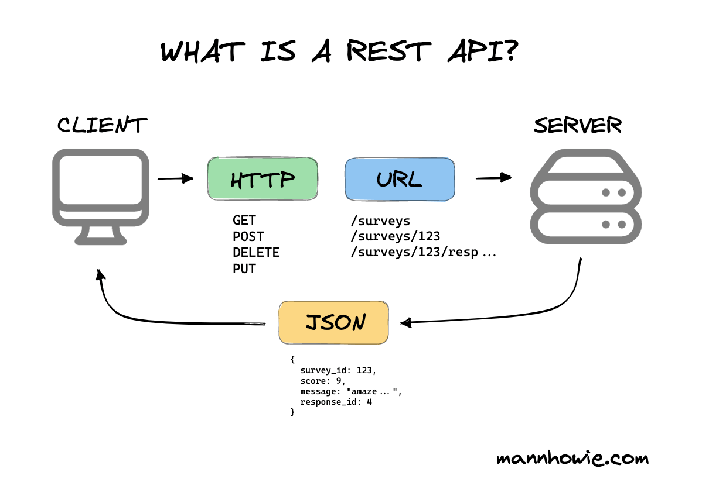

## Intro to APIs

This section provides an introduction to APIs using the REST architecture and HTTP protocol.

### What is an API?

An API is a way for different software applications to communicate with each other. 
For our purposes, the API is what will take the data in your database and give it to the front end you build in the next section.

There are many kinds of APIs and protocols, but we are going to focus on RESTful APIs using HTTP.

### What are REST APIs & HTTP?
(Representational State Transfer Application Programming Interface & Hypertext Transfer Protocol)

REST is an architectural design in which a **client** and **server** communicate using **stateless requests**. There's quite a bit more to it than that, but that's a good start.

#### So... what does that actually mean?

- Client: An application requesting some data
- Server: An application responsible for responding to a client's request by retrieving, processing, and sending the data to the client. *Note: this is a narrow definition of server; but it's accurate for our purposes.*
- Stateless Request: The server treats each request the client sends independently - it doesn't need to keep track of previous requests or store any information, metadata, or anything else in order to process each request.

#### How does this apply to you?

You are going to build all of these.
- Client = the front end app you build next section (and also Bruno...but we'll get to that.)
- Server = Java app you are about to build in this section
- Stateless Request = Your client is going to use these to talk to your server (your front end is going to _request_ data from your Java app; from now on we'll simply call this process a "request")

#### Don't forget about HTTP...
HTTP is a protocol. A protocol is like a contract that defines how different systems can exchange data at the network level. 
HTTP is stateless and follows the request/response model, which makes it a great candidate for RESTful APIs and in fact is the most commonly used protocol for web apps.
We don't need to get into the weeds of the internals of HTTP in this course, but it's important to know there is more to life than HTTP for web developers (but maybe not much.)

#### In Summation...
In this section, you are going to write some Java that gets data from your database and sends it to someone that wants to see it. This works the other way, too: you'll also write some Java that
modifies the data in your database according to a client's request. 

### Further Reading

[REST API Intro - Through "5. DELETE"](https://www.geeksforgeeks.org/node-js/rest-api-introduction/)

[More on request methods](https://restfulapi.net/http-methods/)
