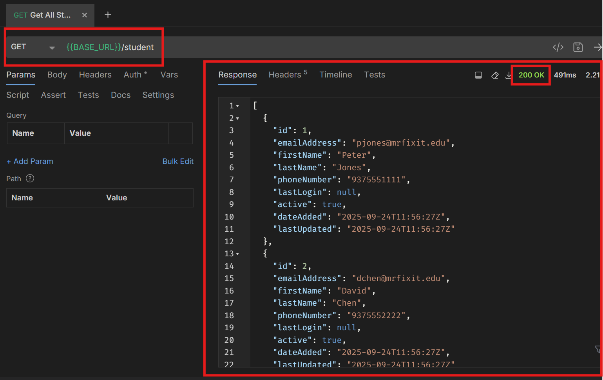

## Homework 0 - Making HTTP Requests

## Purpose / Objectives
> The purpose of this assignment is to get you familiar with the client-server concept, by making HTTP requests using a variety of HTTP methods.
> #### Sorry, no coding yet.

## Description

Perform the following tasks in the demo mr-fix-it repo:

1. Create a branch off of main and name it the local-part of your WSU email address
   2. If your email address is mnoel.5@wright.edu, your branch would be **mnoel**
3. Create a directory under /bruno named **responses**
3. Start and run the demo app
3. Open Bruno and open the Mr. Fix It collection
   4. /mr-fix-it-service/bruno/mr-fix-it-service
5. Get all work orders - GET
   6. Add a GET request to /work-orders
   7. Send the request and verify you get a 200 response
   8. Save a clearly named screenshot of Bruno including the response, URL, request method, and response status code under /bruno/responses
6. Update a student's email address - PUT
   7. Modify the request body in /student/Update Student.bru to update the student's email address to your email address
   8. Send the request and verify you get a 200 response
   9. Save a clearly named screenshot of Bruno including the response, URL, request method, and response status code under /bruno/responses
10. Add a new student - POST
    11. Modify the request body in /student/Add Student.bru to your favorite superhero's information
    12. Send the request and verify you get a 200 response
    13. Save a clearly named screenshot of Bruno including the response, URL, request method, and response status code under /bruno/responses

Here is an example of the required components in the screenshot:

# Rubric

Assignment score: X / 5 points

-   `[ ]` Project runs successfully
-   `[ ]` Screenshot of GET request for retrieving all work orders is saved in correct directory with 200 response status code, URL, response body, and request method visible
-   `[ ]` Screenshot of PUT request for updating student email is saved in correct directory with 200 response status code, URL, response body showing your email address, and request method visible
-   `[ ]` Screenshot of POST request for adding new student is saved in correct directory with 200 response status code, URL, response body showing super hero values, and request method visible
-   `[ ]` Code is pushed to the repository with a clear commit message.
