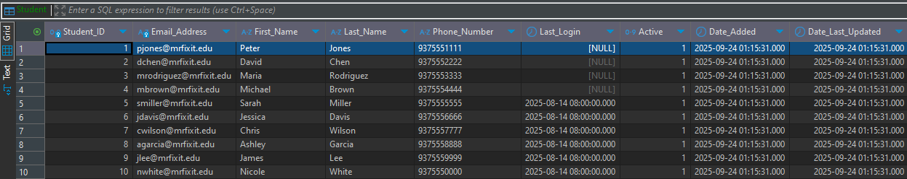
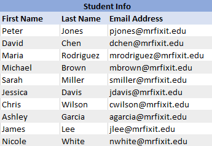
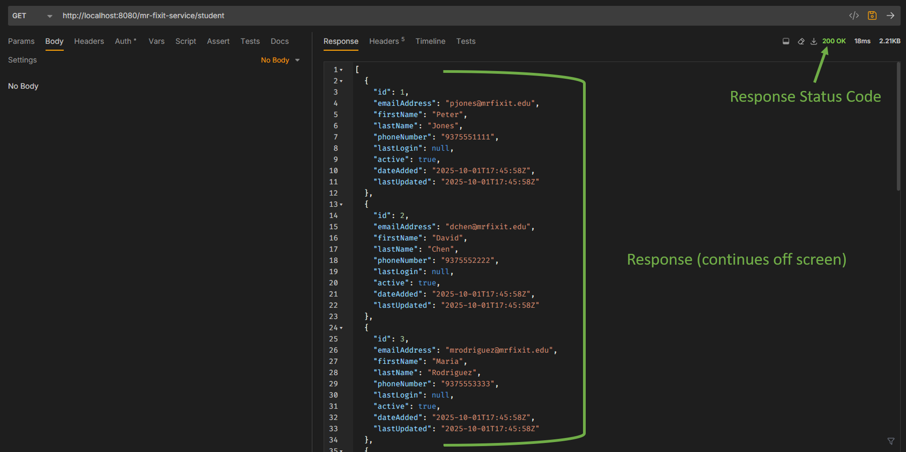

## How APIs Work

#### Let's completely forget about Java for a minute. Let's first think conceptually about what needs to happen.

You have some data in your database:



And you decide you want to display some of the student information on a website, like this:



### But how does this information _get there_ on the website?

That's where APIs come in. They get information and send it wherever it needs to go - whether that's from the database
to the front end, or the front end to the database, or probably whatever other configuration you can think of.

This data gets sent back and forth in the form of JSON (JavaScript Object Notation.) JSON is a text format that uses _key-value_ pairs to hold data.

**Example JSON for students**

The structure is an array of student objects. There is one set of **[]** (array) containing many **{}** (objects)

The column names from the database are the keys; the values are the... values.

```json
[
  {
    "Student_ID": 1,
    "Email_Address": "pjones@mrfixit.edu",
    "First_Name": "Peter",
    "Last_Name": "Jones",
    "Phone_Number": "9375551111",
    "Last_Login": null,
    "Active": 1,
    "Date_Added": "2025-09-24T01:15:31.000Z",
    "Date_Last_Updated": "2025-09-24T01:15:31.000Z"
  },
  {
    "Student_ID": 2,
    "Email_Address": "dchen@mrfixit.edu",
    "First_Name": "David",
    "Last_Name": "Chen",
    "Phone_Number": "9375552222",
    "Last_Login": null,
    "Active": 1,
    "Date_Added": "2025-09-24T01:15:31.000Z",
    "Date_Last_Updated": "2025-09-24T01:15:31.000Z"
  },
  {
    "Student_ID": 3,
    "Email_Address": "mrodriguez@mrfixit.edu",
    "First_Name": "Maria",
    "Last_Name": "Rodriguez",
    "Phone_Number": "9375553333",
    "Last_Login": null,
    "Active": 1,
    "Date_Added": "2025-09-24T01:15:31.000Z",
    "Date_Last_Updated": "2025-09-24T01:15:31.000Z"
  },
  {
    "Student_ID": 4,
    "Email_Address": "mbrown@mrfixit.edu",
    "First_Name": "Michael",
    "Last_Name": "Brown",
    "Phone_Number": "9375554444",
    "Last_Login": null,
    "Active": 1,
    "Date_Added": "2025-09-24T01:15:31.000Z",
    "Date_Last_Updated": "2025-09-24T01:15:31.000Z"
  },
  {
    "Student_ID": 5,
    "Email_Address": "smiller@mrfixit.edu",
    "First_Name": "Sarah",
    "Last_Name": "Miller",
    "Phone_Number": "9375555555",
    "Last_Login": "2025-08-14T08:00:00.000Z",
    "Active": 1,
    "Date_Added": "2025-09-24T01:15:31.000Z",
    "Date_Last_Updated": "2025-09-24T01:15:31.000Z"
  },
  {
    "Student_ID": 6,
    "Email_Address": "jdavis@mrfixit.edu",
    "First_Name": "Jessica",
    "Last_Name": "Davis",
    "Phone_Number": "9375556666",
    "Last_Login": "2025-08-14T08:00:00.000Z",
    "Active": 1,
    "Date_Added": "2025-09-24T01:15:31.000Z",
    "Date_Last_Updated": "2025-09-24T01:15:31.000Z"
  },
  {
    "Student_ID": 7,
    "Email_Address": "cwilson@mrfixit.edu",
    "First_Name": "Chris",
    "Last_Name": "Wilson",
    "Phone_Number": "9375557777",
    "Last_Login": "2025-08-14T08:00:00.000Z",
    "Active": 1,
    "Date_Added": "2025-09-24T01:15:31.000Z",
    "Date_Last_Updated": "2025-09-24T01:15:31.000Z"
  },
  {
    "Student_ID": 8,
    "Email_Address": "agarcia@mrfixit.edu",
    "First_Name": "Ashley",
    "Last_Name": "Garcia",
    "Phone_Number": "9375558888",
    "Last_Login": "2025-08-14T08:00:00.000Z",
    "Active": 1,
    "Date_Added": "2025-09-24T01:15:31.000Z",
    "Date_Last_Updated": "2025-09-24T01:15:31.000Z"
  },
  {
    "Student_ID": 9,
    "Email_Address": "jlee@mrfixit.edu",
    "First_Name": "James",
    "Last_Name": "Lee",
    "Phone_Number": "9375559999",
    "Last_Login": "2025-08-14T08:00:00.000Z",
    "Active": 1,
    "Date_Added": "2025-09-24T01:15:31.000Z",
    "Date_Last_Updated": "2025-09-24T01:15:31.000Z"
  },
  {
    "Student_ID": 10,
    "Email_Address": "nwhite@mrfixit.edu",
    "First_Name": "Nicole",
    "Last_Name": "White",
    "Phone_Number": "9375550000",
    "Last_Login": "2025-08-14T08:00:00.000Z",
    "Active": 1,
    "Date_Added": "2025-09-24T01:15:31.000Z",
    "Date_Last_Updated": "2025-09-24T01:15:31.000Z"
  }
]
```

We aren't going to worry about how to create the JSON, or how to use it just yet - this lesson is focused on how a client gets this JSON.

So let's think about our original use case - taking student data from the database and sending it to the front end. Unfortunately, we haven't built the front end yet. Fortunately, there are things called "API testing tools."

API testing tools allow you to make requests to your sever and see the response. This allows API developers to....well, test....their APIs out before deploying them, to make sure everything works as intended. Front end developers
can also use it to get a visual representation of the data they are consuming.

Postman is a very popular API testing tool that you will probably run across sometime if you haven't already, but we are going to use Bruno.

### Remember how this works: a client makes a _request_ to a server.
1. The client tells the server what it wants.
   - This might be the only client, ever, that has a chance of knowing what they want first try.
2. The server does the necessary processing.
    - This could be selecting, updating, inserting, deleting data from a database, doing math, completely transforming objects, anything really
3. The server sends a response back to the client letting them know how it went.
   - It may send JSON back as well, depending on what the request was.

### So let's go back to the original use case - getting student data from your database. 

Bruno (client) is going to ask (request) a Java service (server) to get student data.

Unsurprisingly, in API terms, this would be called a **GET request.** We'll come back to this in a minute.

## _How_ does a client tell a server what it wants? 

A client constructs a request using these:
- URL
- Headers
- Body (sometimes)
- Request method

### URL
A URL (Uniform Resource Locator) is like an address. 

Think of the Java service as a neighborhood: a collection of houses. Each house is a little different - different people, different amounts of people, different kinds of people - but they are similar enough to all want to live in the same neighborhood.

Pretend you have a new friend that lives in this neighborhood - they probably won't tell you to just show up at the neighborhood and guess which house is theirs. They'll give you a specific address so you know which house to go to.

URLs are just like that. Your Java service will have a _base URL_ - that's kind of like giving just the name of the neighborhood. But you can append more text to the base URL to get to a specific _resource_ (think: house.)

The base URL generally consists of the protocol, host, port, and server context path:

`protocol://host:port/server-context-path`

Here is what a base URL looks like for the Mr. Fix It service:

`http://localhost:8080/mr-fixit-service`

This doesn't really get you anywhere useful though. You need to add to the _path_. This part of the path is generally considered the resource. In our case, the resource is the students. 
A resource is simply whatever you are trying to access or modify in your request.  

You already started a path with the server context path, but let's add the resource:

`protocol://host:port/server-context-path/resource`

And here's what it would really look like:

`http://localhost:8080/mr-fixit-service/student`

An address is super useful - the Java service knows exactly where you want to go, but it needs more information sent in the request to understand what you want to do once you're there.

### Request Method

If you went through the further reading in the README, you'll know what request methods are.

When sending a request, the client sets the request method so that the service knows what's about to happen - is it simply returning data to the client? Is it modifying an existing record? Creating a new one? Deleting one?

While there are more, these are the request methods we are going to learn about:
- **GET**
  - Reads data and returns a representation of the resource. (generally considered "safe" because it does not modify or delete data)
- **POST**
  - Creates new resources
- **PUT**
  - The entire resource is sent in the request body (more on that soon) and it replaces/updates the entire resource. If the resource doesn't exist, it creates a new one.
- **DELETE**
  - Deletes a resource

As stated earlier, our original use case of displaying all the students is a GET request - we want a representation of all the students as they are.

#### Body (sometimes)

If the client is sending a POST or PUT request, it will include a request body. Because POST and PUT requests are modifying or creating a resource, the server needs to know what to update the resource's values to, or what the new resource's values need to be.
This is most commonly done using JSON. 

If student with Student_ID 1 currently looks like this:

```json
  {
    "Student_ID": 1,
    "Email_Address": "pjones@mrfixit.edu",
    "First_Name": "Peter",
    "Last_Name": "Jones",
    "Phone_Number": "9375551111",
    "Last_Login": null,
    "Active": 1,
    "Date_Added": "2025-09-24T01:15:31.000Z",
    "Date_Last_Updated": "2025-09-24T01:15:31.000Z"
  }
```

but the client wants to update the email address, the request body might look like this:

```json
  {
    "Student_ID": 1,
    "Email_Address": "pjones_number_one_student@mrfixit.edu",
    "First_Name": "Peter",
    "Last_Name": "Jones",
    "Phone_Number": "9375551111",
    "Last_Login": null,
    "Active": 1,
    "Date_Added": "2025-09-24T01:15:31.000Z",
    "Date_Last_Updated": "2025-09-24T01:15:31.000Z"
  }
```

The client will send this JSON with the request so that the server can update the student with the latest values.

#### Headers

Headers contain additional information about the request. This is often authorization information or Content-Type. When sending a request body, we need to specify what type of content is being sent. Most commonly, it's `application/json`.

We won't be doing a lot with headers in this course, but you should know they exist and if you have trouble getting an API to work - you just might be missing something in your headers.

### Putting it all together
#### Request
Remember that Bruno is our client today. Here is how we will set up a request in Bruno to get all students:


Bruno is providing a URL, an empty request body, no additional headers, and has the request method set to GET. When this request is sent, it goes to the address in the URL with all the extra information we provided. 
The client doesn't really care _how_ the server processes this request, so we don't really care right now either. We just care that we're going to get all the students back. If we sent the request correctly, we can expect a response back from the server.

#### Response
The server responds with an array of students, just like you saw earlier:



If you were a front end application instead of Bruno, you would get the same response. You'd have access to all of these students in this same structure, and be able to create objects in Typescript representing each student. You can then display them.
The Web Dev class will go over this part in more depth, but it's important to understand an overview of this now. You aren't creating APIs just for the fun of it - a client wants to use your API - so you need to understand the flow.


### Next Steps & Further Reading

Next class you'll lay the groundwork for creating the JSON resources your client needs.

- [JPA - Introduction](https://www.geeksforgeeks.org/java/jpa-introduction/)
- [Simplifying Data Access in Java: A Comparative Look at DAO and Spring Data JPA](https://medium.com/@ksaquib/simplifying-data-access-in-java-a-comparative-look-at-dao-and-spring-data-jpa-6c3d56fd0c22)
- [Accessing Data with JPA](https://spring.io/guides/gs/accessing-data-jpa)

