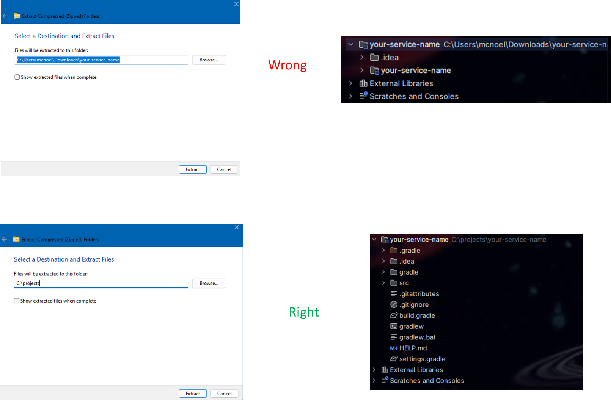

# Generating Your Group Java Project

> For your group project, the below steps should be done on only ONE machine. You can work together as a group to make sure all the steps are followed, but only ONE person will be commiting the initial project. This is to ensure everyone is working off the of the same repo with the same configuration. After the project is in your group repo, then everyone can pull it and work off of it.

## 1. Use spring initializr
- Go to https://start.spring.io/
- This will generate a basic spring project and save you a lot of hassle
- Select the options as shown below. The "Artifact" is whatever you want to name your service. For mr-fixit-service, it's.....mr-fixit-service
- Edit Description however you see fit
- Don't select any dependencies. In future projects you definitely will want to - but this project, you will take exactly what mr-fixit-service has just to keep things consistent.


- Click generate.
- Unzip the downloaded file in the `API` directory of your group repo. (You may need to create the `API` directory)
- Pay close attention to the destination directory when unzipping. Do not include the service name in the path (Windows will default to this.) If you do it incorrectly, when you open the project in your IDE, there will be a `your-service-name` directory nested under another `your-service-name` directory.



## 2. Configure build.gradle file
- Navigate to `/build.gradle` in your project root
- There will already be some basic configuration; we are going to add to it
- Paste this in the `plugins` body
```
id 'com.diffplug.spotless' version '8.0.0'
```
- Add these to the existing `dependencies` body (leave the existing lines there!)
```
annotationProcessor 'org.projectlombok:lombok:1.18.38'
annotationProcessor 'org.mapstruct:mapstruct-processor:1.6.3'
compileOnly 'org.projectlombok:lombok:1.18.38'
implementation 'com.h2database:h2:2.3.232'
implementation 'me.paulschwarz:spring-dotenv:4.0.0'
implementation 'org.mapstruct:mapstruct:1.6.3'
implementation 'org.mariadb.jdbc:mariadb-java-client:3.5.5'
implementation 'org.springframework.boot:spring-boot-starter-data-jpa'
implementation 'org.springframework.boot:spring-boot-starter-validation'
implementation 'org.springframework.boot:spring-boot-starter-web'
testAnnotationProcessor 'org.projectlombok:lombok:1.18.38'
testCompileOnly 'org.projectlombok:lombok:1.18.38'
```
- Paste this below the `dependencies` body to configure code formatting:
```java  
spotless {
    format 'misc', {
        target '*.gradle', '.gitattributes', '.gitignore'
        trimTrailingWhitespace()
        leadingSpacesToTabs()
        endWithNewline()
    }
    java {
        importOrder()
        removeUnusedImports()
        forbidWildcardImports()
        cleanthat()
        palantirJavaFormat('2.74.0').style("GOOGLE")
        formatAnnotations()
    }
    json {
        target 'src/**/*.json'
        jackson()
            .feature('INDENT_OUTPUT', true)
            .feature('ORDER_MAP_ENTRIES_BY_KEYS', true)
    }
    yaml {
        target 'src/**/*.yaml'
        jackson()
            .feature('INDENT_OUTPUT', true)
            .feature('ORDER_MAP_ENTRIES_BY_KEYS', true)
    }
}
  ```

## 3. Configure application.properties
- Navigate to `src/main/resources/application.properties`
- This is where we set up the datasource connection properties and other configuration
- Paste this, changing the url, username, and password to your specific database 
```
# MariaDB connection information
spring.datasource.url=jdbc:mariadb://localhost:3306/Mr_Fix_It
spring.datasource.username=user
spring.datasource.password=password

# Needed for Case Sensitive Tables and Columns
spring.jpa.hibernate.naming.physical-strategy=org.hibernate.boot.model.naming.PhysicalNamingStrategyStandardImpl
```
- Set the context path (this will be part of the URLs that route to your service: http://localhost:8080/server-context-path)

```server.servlet.context-path=/your-service-name```

## 4. Verify the project builds and runs
- Right click on `src/main/java/{your-path}{YourServiceNameApplication.java}`
- Select "Run Java"
- Wait for the console to display: "Started YourServiceNameApplication in x seconds"

## 5. git add, commit, push to your remote group repo


