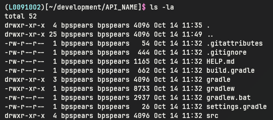

# Generating Your Group Java Project

> For your group project, the below steps should be done on only ONE machine. You can work together as a group to make sure all the steps are followed, but only ONE person will be commiting the initial project. This is to ensure everyone is working off the of the same repo with the same configuration. After the project is in your group repo, then everyone can pull it and work off of it.

## 1. Use spring initializr
- Normally you would go to [Spring Initializr](https://start.spring.io/) and then set the appropriate selections for the project you are trying to create. Then you would generate and download the zip file, then extract to an appropriate location and you'd be done, however there is a known issue with WSL copying files from Windows, so instead we are providing a wget command for to download a base project
- `wget "https://start.spring.io/starter.zip?javaVersion=17&name=API_NAME" -O API_NAME.zip` will download the zip file to the current directory. Change API_NAME to the name for your service
- Use the unzip command `unzip API_NAME.zip -d API_NAME` to get the contents in a usable format. If you are getting an error stating that the unzip command is not found, install it using `apt install unzip` or the appropriate package manager for your environment
- After you have unzipped, move the folder (the contents should be similar to the root directory for mr-fixit-service) to where you would prefer to keep it located 
> It is recommend to put your service folder in a development folder in your home directory, `mv API_NAME ~/development`. If there is a sub-folder named the same as the service, move that folder instead.

### Example of expected structure


## 2. Configure build.gradle file
- Navigate to `/build.gradle` in your project root
- There will already be some basic configuration; we are going to add to it
- Paste this in the `plugins` body
```
id 'com.diffplug.spotless' version '8.0.0'
```
- Add these to the existing `dependencies` body (leave the existing lines there!)
```
annotationProcessor 'org.projectlombok:lombok:1.18.38'
annotationProcessor 'org.mapstruct:mapstruct-processor:1.6.3'
compileOnly 'org.projectlombok:lombok:1.18.38'
implementation 'com.h2database:h2:2.3.232'
implementation 'me.paulschwarz:spring-dotenv:4.0.0'
implementation 'org.mapstruct:mapstruct:1.6.3'
implementation 'org.mariadb.jdbc:mariadb-java-client:3.5.5'
implementation 'org.springframework.boot:spring-boot-starter-data-jpa'
implementation 'org.springframework.boot:spring-boot-starter-validation'
implementation 'org.springframework.boot:spring-boot-starter-web'
testAnnotationProcessor 'org.projectlombok:lombok:1.18.38'
testCompileOnly 'org.projectlombok:lombok:1.18.38'
```
- Paste this below the `dependencies` body to configure code formatting:
```java  
spotless {
    format 'misc', {
        target '*.gradle', '.gitattributes', '.gitignore'
        trimTrailingWhitespace()
        leadingSpacesToTabs()
        endWithNewline()
    }
    java {
        importOrder()
        removeUnusedImports()
        forbidWildcardImports()
        cleanthat()
        palantirJavaFormat('2.74.0').style("GOOGLE")
        formatAnnotations()
    }
    json {
        target 'src/**/*.json'
        jackson()
            .feature('INDENT_OUTPUT', true)
            .feature('ORDER_MAP_ENTRIES_BY_KEYS', true)
    }
    yaml {
        target 'src/**/*.yaml'
        jackson()
            .feature('INDENT_OUTPUT', true)
            .feature('ORDER_MAP_ENTRIES_BY_KEYS', true)
    }
}
  ```

## 3. Configure application.properties
- Navigate to `src/main/resources/application.properties`
- This is where we set up the datasource connection properties and other configuration
- Paste this, changing the url, username, and password to your team database 
```
# MariaDB connection information
spring.datasource.url=jdbc:mariadb://localhost:3306/Mr_Fix_It
spring.datasource.username=user
spring.datasource.password=password
# Needed for Case Sensitive Tables and Columns
spring.jpa.hibernate.naming.physical-strategy=org.hibernate.boot.model.naming.PhysicalNamingStrategyStandardImpl
```
- Set the context path (this will be part of the URLs that route to your service: http://localhost:8080/server-context-path)

```server.servlet.context-path=/your-service-name```

## 4. Add Visual Studio Code settings
- Copy the .vscode folder from mr-fixit-service to your repository. This will ensure that spotless and java are configured correctly for you.

## 5. Verify the project builds and runs
- Right click on `src/main/java/{your-path}{YourServiceNameApplication.java}`
- Select "Run Java"
- Wait for the console to display: "Started YourServiceNameApplication in x seconds"

## 6. Push to GitHub
- To initialize git for the repo, use the `git init` command
- It is recommended to rename your default branch to develop using `git branch -m develop`
- To set the location on GitHub for your repo, use `git remote add origin REPO_URL`. The REPO_URL should end with .git and can be found in your GitHub repository page.
- Verify that the URL was set correctly `git remote -v`
- Add all files and create a commit message indicating that you used Spring Initializr to create the repository
- Push your changes to GitHub `git push origin main`