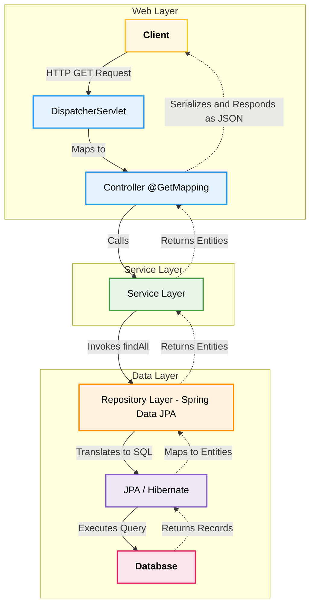

```mermaid
graph TD

    %% --- WEB LAYER ---
    subgraph Web_Layer[Web Layer]
        A[Client]:::client
        B[DispatcherServlet]:::mvc
        C[Controller @GetMapping]:::mvc

        A -->|HTTP GET Request| B
        B -->|Maps to| C
    end

    %% --- SERVICE LAYER ---
    subgraph Service_Layer[Service Layer]
        D[Service Layer]:::service
    end

    %% --- DATA LAYER ---
    subgraph Data_Layer[Data Layer]
        E[Repository Layer - Spring Data JPA]:::repo
        F[JPA / Hibernate]:::jpa
        G[Database]:::db
    end

    %% --- REQUEST FLOW ---
    C -->|Calls| D

    D -->|Invokes findAll| E

    E -->|Translates to SQL| F

    F -->|Executes Query| G

    %% --- RESPONSE FLOW ---
    G -.->|Returns Records| F

    F -.->|Maps to Entities| E

    E -.->|Returns Entities| D

    D -.->|Returns Entities| C

    C -.->|Serializes and Responds as JSON| A

    %% --- STYLES ---
    classDef client fill:#fff8e1,stroke:#fbc02d,stroke-width:2px,color:#000,font-weight:bold
    classDef mvc fill:#e3f2fd,stroke:#2196f3,stroke-width:2px,color:#000
    classDef service fill:#e8f5e9,stroke:#43a047,stroke-width:2px,color:#000
    classDef repo fill:#fff3e0,stroke:#fb8c00,stroke-width:2px,color:#000
    classDef jpa fill:#ede7f6,stroke:#7e57c2,stroke-width:2px,color:#000
    classDef db fill:#fce4ec,stroke:#e91e63,stroke-width:2px,color:#000,font-weight:bold

```
