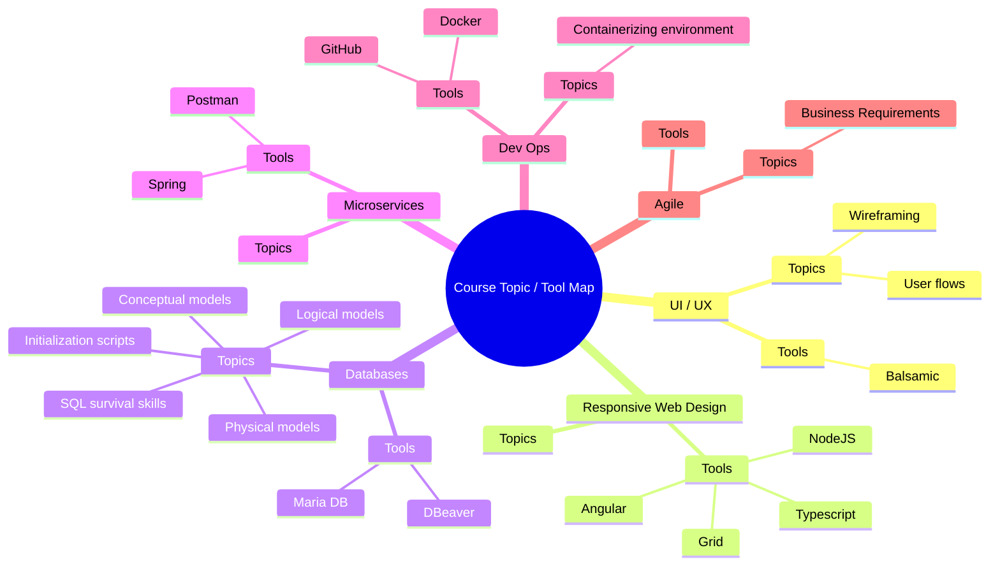

```mermaid
mindmap
  root((Course Topic / Tool Map))
    UI / UX
      Tools
        Balsamic
      Topics
        User flows
        Wireframing
    Responsive Web Design
      Tools
        Angular
        Grid
        Typescript
        NodeJS
      Topics
    Databases
      Tools
        Maria DB
        DBeaver
      Topics
        Conceptual models
        Logical models
        Physical models
        Initialization scripts
        SQL survival skills
    Microservices
      Tools
        Postman
        Spring
      Topics
    Dev Ops
      Tools
        GitHub
        Docker
      Topics
        Containerizing environment
    Agile
      Tools
      Topics
        Business Requirements
```
